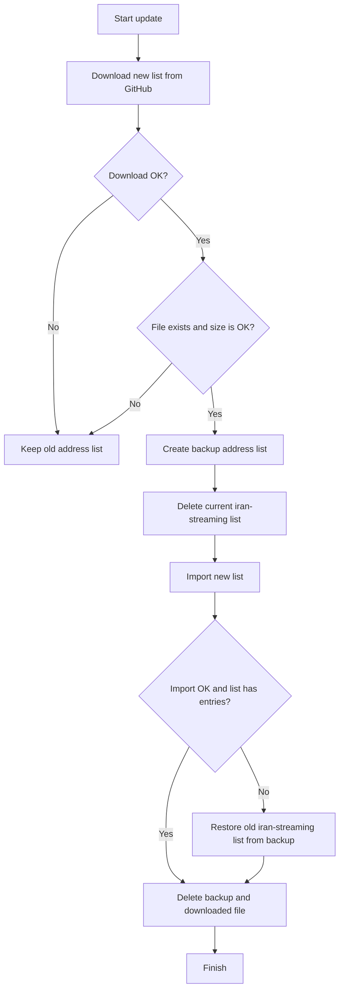

# Iran Streaming Route List for MikroTik

This repository creates MikroTik address-list files for routing Iranian video, VOD, live TV, and streaming traffic through a selected outbound path.

The project keeps source domains, discovered hostnames, resolved IPs, and RouterOS updater scripts separate so updates can be refreshed safely.

## Included Services

The source list starts with popular Iranian video and streaming platforms, including:

- Filimo
- Aparat
- Aparat Kids
- Namava
- Telewebion
- Anten
- Lenz
- Tamasha
- Namasha
- Shabakema
- IMVBox
- IRIB / iFilm / TV-related services
- related media/CDN domains such as Saba Idea and Saba Vision

Edit this file to add or remove services:

```text
config/domains.txt
```

## Data Source

The generator collects streaming-related hosts and URLs from:

- configured root domains in `config/domains.txt`
- common service hostnames such as `api`, `cdn`, `static`, `vod`, `video`, `live`, `stream`, and `player`
- certificate transparency results
- recent public `urlscan.io` observations
- links found on the configured service pages
- current DNS A records for discovered hostnames

Streaming services can use CDN-style delivery, so the MikroTik output uses discovered FQDN address-list entries. RouterOS resolves those names dynamically using the router DNS configuration and can add multiple IPs for one hostname. The builder also writes public IPv4 files for inspection and fallback use.

No public method can guarantee every private/internal CDN URL, but these sources give a repeatable public-domain discovery process for route-list generation.

## Address Lists

| File | RouterOS address list | Purpose |
| --- | --- | --- |
| `mikrotik-iran-streaming-address-list.rsc` | `iran-streaming` | All discovered streaming FQDN hosts for policy routing |
| `iran-streaming-domains.txt` | - | Discovered streaming hostnames |
| `iran-streaming-hosts.txt` | - | Hostnames resolved by the builder |
| `iran-streaming-urls.txt` | - | Discovered streaming URLs and page URLs |
| `iran-streaming-ips.txt` | - | Public IPv4 addresses |
| `iran-streaming-prefixes.txt` | - | Public IPv4 `/32` prefixes |

## Recommended Safe Install

After renaming this repository to `iran-streaming-route-list`, use this on MikroTik:

```routeros
/tool fetch url="https://raw.githubusercontent.com/mohavise/iran-streaming-route-list/main/safe-install-iran-streaming-small-router.rsc" dst-path=safe-install-iran-streaming-small-router.rsc mode=https
/import file-name=safe-install-iran-streaming-small-router.rsc
/file remove [find name=safe-install-iran-streaming-small-router.rsc]
```

## Manual Install

Install only the updater script:

```routeros
/tool fetch url="https://raw.githubusercontent.com/mohavise/iran-streaming-route-list/main/update-iran-streaming-small-router.rsc" dst-path=update-iran-streaming-small-router.rsc mode=https
/import file-name=update-iran-streaming-small-router.rsc
/system script run update-iran-streaming-small-router
```

## Automatic Router Updates

After importing the updater script, import the scheduler file:

```routeros
/tool fetch url="https://raw.githubusercontent.com/mohavise/iran-streaming-route-list/main/scheduler-update-iran-streaming-small-router.rsc" dst-path=scheduler-update-iran-streaming-small-router.rsc mode=https
/import file-name=scheduler-update-iran-streaming-small-router.rsc
```

Default router schedule:

| Scheduler | Time |
| --- | --- |
| Iranian streaming updates | `04:00:00` daily |

## Safety Logic

The updater script avoids deleting a good old address list when the new download is broken or empty.

Update flow:



The temporary backup list is:

```text
iran-streaming-backup-before-update
```

## Automatic GitHub List Updates

The repository includes a GitHub Actions workflow:

```text
.github/workflows/update.yml
```

It runs every day at `23:30 UTC`, matching the update timing style used by `Get-IP-Iran-evo`, and regenerates:

- `iran-streaming-domains.txt`
- `iran-streaming-hosts.txt`
- `iran-streaming-urls.txt`
- `iran-streaming-ips.txt`
- `iran-streaming-prefixes.txt`
- `mikrotik-iran-streaming-address-list.rsc`

You can also run it manually from the GitHub Actions tab.

## Generate Lists Manually

Run from Git Bash on Windows or from any Bash shell:

```bash
./scripts/build-iran-streaming.sh
```

If Python is installed but not on your Git Bash `PATH`, pass it explicitly:

```bash
IRAN_STREAMING_PYTHON=/c/path/to/python.exe ./scripts/build-iran-streaming.sh
```

## MikroTik Policy Routing Example

Example only; adjust your routing table and gateway to your own design.

```routeros
/routing table add name=to-outbound fib
/ip firewall mangle add chain=prerouting dst-address-list=iran-streaming action=mark-routing new-routing-mark=to-outbound passthrough=no comment="Iran streaming to outbound"
/ip route add dst-address=0.0.0.0/0 gateway=<YOUR-OUTBOUND-GATEWAY> routing-table=to-outbound
```
